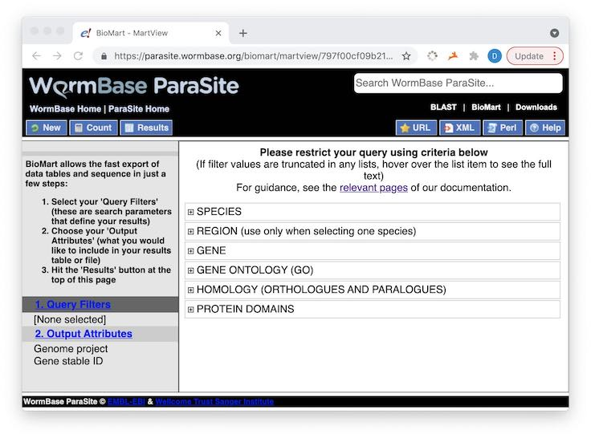
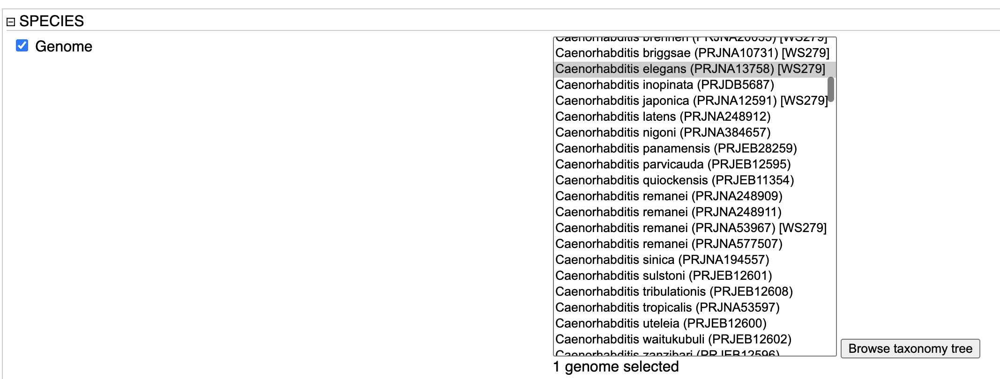
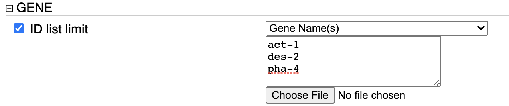
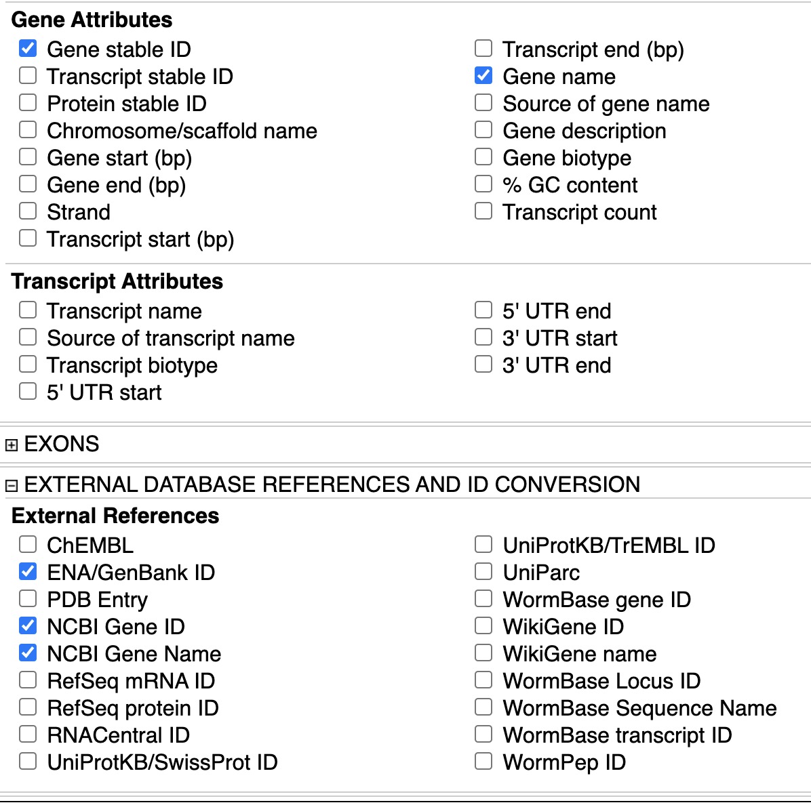
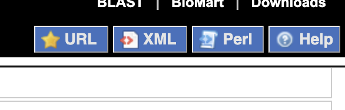

It is frequently necessary to map the abbreviated gene name, such as *act-1* for *actin*, into its unique identifier, or accession number, in a given database such as WormBase.  This vignette shows how to query the database by the gene name and retrieve other IDs associated with a given gene or set of genes.

```{r, include = FALSE}
knitr::opts_chunk$set(
  collapse = TRUE,
  comment = "#>"
)
```

```{r setup}
library(ParasiteXML)
library(biomaRt)
```

# Getting the template from Paramart

Go to https://parasite.wormbase.org/biomart to design your query. *Note: The  "martview/71228acdfe812347da" is automatically assigned after loading the page.*

## 1. Query Filters

These are the fields of the database you are using to select the data.

The image below shows six general categories: SPECIES, REGION, GENE, GENE ONTOLOGY (GO), HOMOLOGY (ORTHOLOGUES AND PARALOGUES), and PROTEIN DOMAINS. We will be using SPECIES and GENE in order to translate IDs.


### Select species 

Be sure to select *C. elegans* here, because some IDs are reused in other species.




### Select gene name 

These are some gene names to translate. You can expand this list in R.



## 2. Output Attributes 
The data you are requesting from WormBase ParaSite. These will be all of the other types of IDs available. Clicking on **2. Output Attributes --> Gene** reveals the following:



Notice that we also selected *gene name* as output. **This is important** because the input query 

**Now, the selected query will translate the gene name to all of the selected alternate names.**

## Step 3 - get the query XML.

Clicking on the XML button, the query is formulated from the web input.



The output is the following text:

<!-- used this: https://www.freeformatter.com/html-escape.html to escape the XML output -->
<pre>
&lt;?xml version=&quot;1.0&quot; encoding=&quot;UTF-8&quot;?&gt;
&lt;!DOCTYPE Query&gt;
&lt;Query  virtualSchemaName = &quot;parasite_mart&quot; formatter = &quot;TSV&quot; header = &quot;0&quot; uniqueRows = &quot;0&quot; count = &quot;&quot; datasetConfigVersion = &quot;0.6&quot; &gt;
                
    &lt;Dataset name = &quot;wbps_gene&quot; interface = &quot;default&quot; &gt;
        &lt;Filter name = &quot;gene_name&quot; value = &quot;act-1,des-2,pha-4&quot;/&gt;
        &lt;Filter name = &quot;species_id_1010&quot; value = &quot;caelegprjna13758&quot;/&gt;
        &lt;Attribute name = &quot;production_name_1010&quot; /&gt;
        &lt;Attribute name = &quot;wbps_gene_id&quot; /&gt;
        &lt;Attribute name = &quot;external_gene_id&quot; /&gt;
        &lt;Attribute name = &quot;embl&quot; /&gt;
        &lt;Attribute name = &quot;entrezgene_id&quot; /&gt;
        &lt;Attribute name = &quot;entrezgene_name&quot; /&gt;
    &lt;/Dataset&gt;
&lt;/Query&gt;
</pre>

## 4. With your mouse, select and copy this text and paste it into a single-quoted string.

Use a single quote because the XML text contains double quotes. Otherwise, you will have multiple syntax errors.


```{r query-string}

query = '<?xml version="1.0" encoding="UTF-8"?>
<!DOCTYPE Query>
<Query  virtualSchemaName = "parasite_mart" formatter = "TSV" header = "0" uniqueRows = "0" count = "" datasetConfigVersion = "0.6" >
                
    <Dataset name = "wbps_gene" interface = "default" >
        <Filter name = "gene_name" value = "act-1,des-2,pha-4"/>
        <Filter name = "species_id_1010" value = "caelegprjna13758"/>
        <Attribute name = "production_name_1010" />
        <Attribute name = "wbps_gene_id" />
        <Attribute name = "external_gene_id" />
        <Attribute name = "embl" />
        <Attribute name = "entrezgene_id" />
        <Attribute name = "entrezgene_name" />
    </Dataset>
</Query>'

```
